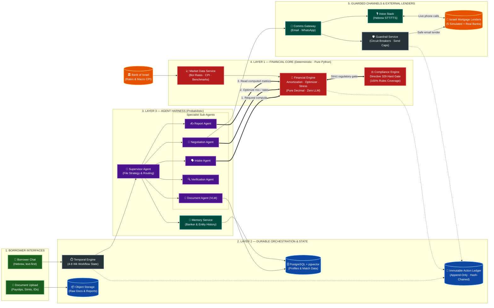

# Autonomous Mortgage Advisor — Technical Roadmap

**Last Updated**: August 27, 2026
**Status**: 🟡 **PRE-POC** | Architecture designed, no code written

---

## 1. The Central Architectural Insight

A mortgage file is not a request/response system and it is not a batch pipeline. It is a **long-running, stateful, multi-party negotiation lasting 4 to 8 weeks**, in which the system must wait for humans, act on timers, survive process restarts, remember everything, and never lose or duplicate a side effect that was sent to a bank.

That single characteristic drives nearly every decision below. The system is best understood as three concentric layers with strictly enforced boundaries:

```
┌───────────────────────────────────────────────────────────────┐
│  LAYER 3 — AGENT HARNESS (probabilistic)                      │
│  Language, documents, judgment, strategy, negotiation.        │
│  Allowed to be wrong. Never allowed to compute or decide      │
│  compliance.                                                  │
├───────────────────────────────────────────────────────────────┤
│  LAYER 2 — DURABLE ORCHESTRATION (deterministic control flow) │
│  Workflow state, timers, retries, replay, side-effect         │
│  exactly-once guarantees, audit ledger.                       │
├───────────────────────────────────────────────────────────────┤
│  LAYER 1 — FINANCIAL CORE (deterministic, verified)           │
│  Amortization, optimization, compliance, stress testing.      │
│  Pure functions. No LLM. No network. 100% tested.             │
└───────────────────────────────────────────────────────────────┘
```

**The boundary between Layer 3 and Layer 1 is the most important line in the system.** Every number that reaches a client or a lender originates in Layer 1. Layer 3 may request a computation, may explain a computation, and may choose between computed options — but it may never produce a figure. Enforced structurally: client- and lender-facing numeric fields are populated only from typed Layer 1 return values, and a CI check fails the build if a numeric field in an outbound template is bound to model output.

---

## 2. Architecture Overview



**Key:**
- **Red (Layer 1)** never calls an LLM and never touches the network. Pure, testable, verifiable.
- **Purple (Layer 3)** never produces a number that leaves the system.
- Every arrow crossing into or out of Layer 1 is a typed contract.
- Every outbound communication passes the Guardrail Service and lands in the Action Ledger before transmission.

---

## 3. The File Lifecycle Workflow

A single Temporal workflow per file, living 4–8 weeks:

```
CREATED
  → INTAKE            (conversation + document collection, loops with timers)
  → PROFILED          (validated financial profile, discrepancies resolved)
  → STRUCTURED        (compliant mixes generated, stress-tested, one selected)
  → PACKAGED          (lender-ready file assembled per lender)
  → TENDER_OPEN       (submissions out, awaiting replies, follow-up timers)
  → NEGOTIATING       (multi-round, per-lender child workflows)
  → RECOMMENDED       (client report delivered, awaiting decision)
  → EXECUTING         (approval, appraisal, contract verification)
  → VERIFIED          (contract matches negotiated terms)
  → FUNDED            (fee collected, Mortgage Watch enrolled)
  → MONITORING        (indefinite; refinance triggers)
```

Each state transition is a durable checkpoint. Each lender in the tender runs as a **child workflow**, so one unresponsive bank cannot stall the file and each lender's negotiation carries its own timers and retry policy independently.

Timer-driven behavior is where most of a broker's actual calendar lives, and it is nearly free in this model:

| Trigger | Action |
|---------|--------|
| No lender reply in 48h | Autonomous follow-up email |
| No lender reply in 96h | Escalate: different contact, or voice |
| Borrower document missing 24h | Reminder |
| Borrower silent 72h | Re-engagement |
| Offer expiry approaching | Decision forcing, use as negotiation leverage |
| Anchor reset date approaching (post-funding) | Refinance analysis |
| BoI rate change published | Portfolio-wide refinance scan |

---

## 4. Technology Stack

### Layer 2 — Durable Orchestration

**Temporal** (self-hosted for POC, Temporal Cloud from Phase 1)

This is the highest-consequence technology choice in the document. See §6 Decision 1 for the reasoning.

### Layer 1 — Financial Core

- **Python**, pure functions, zero I/O, zero network, zero LLM
- **`Decimal` throughout — floats are banned.** Interest arithmetic in floats produces off-by-agorot errors that destroy client trust and are indefensible in a contract dispute.
- **Optimizer**: OR-Tools CP-SAT for the constrained mix search, with an exhaustive brute-force implementation retained permanently as the correctness oracle on reduced problems
- **Compliance engine**: explicit rules engine, 100% branch coverage, every rule carrying a citation to its Directive 329 source
- **Property-based testing** (Hypothesis) on top of example-based tests — invariants like "total payments always exceed principal" and "shortening the term never reduces total interest" catch classes of bug that fixed examples miss
- Packaged as a library, callable in-process; exposed over HTTP only for the independent verification service

### Layer 3 — Agent Harness

- **Python**, **FastAPI** for service surfaces
- **Structured outputs everywhere** (Pydantic + native structured output APIs). No free-text parsing of model output on any path that affects state.
- **Model tiering** — routed per task, not per system:
  - *Frontier tier*: negotiation strategy, contract verification, discrepancy adjudication, final recommendation rationale
  - *Mid tier*: intake conversation, email drafting, offer parsing
  - *Vision tier*: document extraction
  - *Small tier*: classification, routing, extraction of simple fields
- **Prompt caching** aggressively on the large stable context (borrower profile, market context, playbook). This is the dominant cost lever — see §9.
- **Langfuse** for tracing, per-file cost attribution, and prompt versioning

**Agent topology**: a supervisor with specialist sub-agents, not a swarm. The supervisor owns file strategy and routing; specialists own bounded tasks with narrow tool access. Specialists cannot call each other — all coordination goes through the supervisor and therefore through Temporal, which is what makes agent behavior auditable and replayable rather than emergent.

### Data Layer

| Store | Purpose |
|-------|---------|
| **PostgreSQL 16 + pgvector** | Files, profiles, extracted document fields, offers, contacts, memory embeddings, settings |
| **Immutable Action Ledger** | Append-only table, hash-chained. Every autonomous action, every outbound message, every Layer 1 computation with inputs and outputs. Never updated, never deleted. |
| **Object storage** (MinIO local / S3 prod) | Source documents, generated reports, call recordings |
| **Redis** | Caching, rate limiting, ephemeral session state. **Not** used as the workflow queue — that is Temporal's job. |

### Communication Gateway

| Channel | Implementation | Phase |
|---------|---------------|-------|
| **Email** | Dedicated sending domain, SPF/DKIM/DMARC, gradually warmed reputation. Threading and attachment handling. Inbound parsing via a receiving webhook. | P0 |
| **Voice** | SIP trunk with Israeli DID; media handled by the voice stack below | P1 (wk 9–12) |
| **WhatsApp** | WhatsApp Business API, borrower-side only | P2 |
| **Web chat** | Borrower intake | P0 |

**Email deliverability is a first-class engineering concern, not an afterthought.** A cold domain sending structured financial requests to bank addresses is a spam-filter magnet, and if our mail silently lands in junk the entire business stops working while appearing to function. Requires: warmed domain, human-paced send scheduling, per-institution rate limits, reply-rate monitoring per lender as a leading indicator of filtering (see `BUSINESS_PLAN.md` R1), and bounce/complaint handling.

### Voice Stack (Phase 0.5)

| Component | Choice | Notes |
|-----------|--------|-------|
| **STT** | `ivrit-ai/whisper-large-v3-turbo-ct2` via `faster-whisper`, streaming | Hebrew-specialized, trained on ~295h volunteer + ~93h professional Hebrew speech. RunPod serverless at roughly **$0.03 per transcribed hour** makes STT cost effectively irrelevant. Streaming supported via the `ivrit` package. |
| **TTS** | **BlueTTS via MamboTTS** ([repo](https://github.com/maxmelichov/MamboTTS)) | Local ONNX Hebrew TTS, offline after model download, named saved voices for a consistent brand identity. `crates/mambotts-py` exposes the engine to Python with a FastAPI server, which is the integration path for Linux/cloud deployment (the desktop app targets macOS Apple Silicon). Optional Qwen3-TTS-he runtime supports reference-audio voice cloning if a specific voice identity is wanted. |
| **Turn-taking** | Silero VAD + custom barge-in and backchannel logic | The hard part. Hebrew conversational rhythm with a banker is not the same as an English demo. |
| **Latency budget** | < 800ms perceived response | STT partials + speculative LLM start + TTS first-chunk streaming. Achieving this is the primary technical risk of the voice phase. |
| **Recording** | Full recording with lawful notice, stored encrypted | One-party consent, lawful. See `REGULATORY_STRATEGY.md` §2. |

**Why self-hosted rather than a commercial realtime voice API**: Hebrew quality from general-purpose providers is materially worse than Hebrew-specialized models; we need a *consistent* voice identity across every call for months, which commercial voice catalogs do not guarantee; and cost at scale on realtime APIs would become the dominant line item in the unit economics rather than a rounding error.

### Market Data Service

Scheduled ingestion of: Bank of Israel policy rate and prime; CPI prints; BoI published average mortgage rates by track and month (the benchmark for our headline efficacy metric and for negotiation leverage — "your offer is 0.4% above the published average for this mix"); and our own tender results, which become the proprietary benchmark described in `BUSINESS_PLAN.md` §4.2.

### Guardrail Service

Full autonomy requires **bounds**, not approvers. The guardrails are the substitute for a human gate:

| Guardrail | Behavior |
|-----------|----------|
| **Irreversible-action circuit breaker** | Actions classified reversible / hard-to-reverse / irreversible. Irreversible actions (submitting a binding acceptance, signing anything, committing to a rate lock) require a signed borrower mandate token scoped to that specific action, obtained during intake. Absent a valid token, the action is refused and the file escalates to the client, not to us. |
| **Spend cap per file** | Hard ceiling on LLM/voice spend. On breach: pause workflow, alert. Prevents a prompt loop from costing more than the fee. |
| **Communication rate limits** | Per lender, per institution, per hour and per day. Protects deliverability and prevents a retry storm from looking like an attack. |
| **Factual assertion gate** | Any outbound claim about the borrower's finances must resolve to a value in the validated profile with a document provenance chain. Unresolvable claims block the send. This is the code-level enforcement of the boundary in `REGULATORY_STRATEGY.md` §5. |
| **Compliance gate** | No structure reaches a lender or client without passing the compliance engine. Not bypassable by configuration. |
| **Identity uniqueness** *(Phase 3)* | One advisor identity per (institution, branch) and per (borrower, institution). Unique database index, not a policy check. See Decision 12. |
| **Anomaly halt** | Statistical monitors on recommendation outputs. A recommendation that is a significant outlier against the population halts for review. |

### Observability

Langfuse (LLM tracing, per-file cost) · Temporal Web (workflow state and history) · Prometheus + Grafana (system metrics, business metrics, eval scores over time) · structured logs with file-scoped correlation IDs · the Action Ledger as the compliance-grade record of truth.

---

## 5. Services & Deployment

### Local Development

```
docker-compose.yml
├── api                  (FastAPI: chat, upload, portal)
├── worker-agents        (Temporal workers: agent activities)
├── worker-financial     (Temporal workers: Layer 1 activities)
├── worker-comms         (Temporal workers: email/voice send + receive)
├── financial-verifier   (independent recomputation service)
├── voice                (STT/TTS/turn-taking — Phase 0.5)
├── lender-sim           (5 simulated lenders + local SMTP)
├── temporal + temporal-ui
├── postgres (pgvector)
├── redis
├── minio
├── mailhog              (local mail capture)
└── langfuse + prometheus + grafana
```

### Production (POC → Phase 1)

Deliberately modest. The workload is low-volume and long-duration, which is the opposite of what elastic container fleets are for. Over-provisioning here is a common and expensive mistake.

| Component | POC / Phase 1 spec | Notes |
|-----------|-------------------|-------|
| App + workers | 2 small container instances | Long-lived, low CPU. Temporal handles concurrency. |
| Temporal | Self-hosted (POC) → Temporal Cloud (Phase 1) | Cloud is worth it the moment real files exist |
| PostgreSQL | Managed, single-AZ (POC) → Multi-AZ (Phase 1) | Encrypted at rest, PITR |
| Redis | Managed, single node | |
| Object storage | S3, encrypted, versioned | |
| Voice GPU | RunPod serverless, scale-to-zero | Idle cost near zero. Critical: calls are rare and bursty. |
| Email | Transactional provider + dedicated warmed domain | |
| Monitoring | Small always-on instance | Langfuse + Prometheus + Grafana |

### Scaling Characteristics

Worth being explicit about, because it is unusual: **this system barely scales with volume.** A file consumes almost no continuous compute — it consumes calendar time waiting for humans. 150 concurrent files is not 150× the load of one file; it is 150 sleeping workflows and an occasional burst of LLM calls. The cost driver is *files started*, not *files in flight*, and it is dominated by LLM tokens rather than infrastructure. This is why the Phase 2 infrastructure line in `BUSINESS_PLAN.md` §3.3 is only ~$2,200/month at 150 files.

---

## 6. Key Technical Decisions

### Decision 1 — Temporal for durable orchestration
- **Decision**: Temporal workflows as the backbone, not Celery, not Redis Streams, not a state machine in Postgres.
- **Reason**: A file lives 4–8 weeks, sleeps on human replies, acts on dozens of timers, and must never double-send a message to a bank. Temporal gives durable timers, exactly-once side effects, automatic retry with backoff, workflow versioning for deploys mid-file, and — most valuable — **complete replayable execution history**, which doubles as our regulatory audit trail. Building this on a queue plus a state table means reimplementing all of it badly. The example project's Redis Streams pipeline was correct for stateless batch work and would be actively wrong here.
- **Cost**: real conceptual overhead (determinism constraints in workflow code, activity/workflow separation). Accepted deliberately.
- **Status**: ⬜ Not started

### Decision 2 — The LLM never computes and never adjudicates compliance
- **Decision**: All arithmetic and all regulatory evaluation live in Layer 1. Enforced by CI, not convention.
- **Reason**: This is the difference between a business and a lawsuit. LLM arithmetic is unreliable at exactly the tail where it matters, and an LLM's compliance judgment is unauditable — we could never explain to a regulator or a court *why* a structure was approved. A deterministic engine gives an exact, reproducible, citable answer every time. It is also far cheaper.
- **Enforcement**: outbound numeric fields bind only to typed Layer 1 returns; a build-time check fails on violation; every recommendation carries a provenance chain from displayed number to computation to inputs to source document.
- **Status**: ⬜ Not started

### Decision 3 — Independent recomputation before anything reaches a client
- **Decision**: A second, independently written implementation recomputes every recommended structure. Disagreement halts the file.
- **Reason**: The compliance engine and optimizer are single points of catastrophic failure. Two implementations by different authors from the same spec catch specification misreadings that no amount of testing against your own understanding will. Cheap insurance — these are pure functions and the recomputation costs microseconds.
- **Status**: ⬜ Not started

### Decision 4 — Simulated lenders are production infrastructure
- **Decision**: The 5 simulated lenders are a permanent, first-class system component with their own tests, not POC scaffolding to be deleted.
- **Reason**: Negotiation is the only capability with no ground truth in production — we never learn what rate the bank *would* have accepted. Simulated lenders with known concession curves give us a measurable optimum, which makes negotiation quality improvable rather than merely observable. They are also the only safe environment for testing changes to negotiation behavior, and the only regression suite that can catch a tactic change making us worse.
- **Status**: ⬜ Not started

### Decision 5 — Text-first, voice on escalation
- **Decision**: Every capability is reachable over text. Voice is an escalation path triggered by counterparty preference, not a parallel primary interface.
- **Reason**: Text is cheaper, more reliable, auditable by construction, asynchronous (which suits a multi-week file), and produces a written record that is useful in a contract dispute. Voice exists because some bankers insist. Building voice-first would put the hardest and least reliable component on the critical path of every file.
- **Consequence**: the escalation boundary is defined and stubbed in the POC (week 7) so that voice slots in without restructuring.
- **Status**: ⬜ Not started

### Decision 6 — Self-hosted Hebrew voice
- **Decision**: `ivrit-ai` Whisper for STT, BlueTTS/MamboTTS for TTS, self-hosted on scale-to-zero GPU.
- **Reason**: Hebrew-specialized models materially outperform general multilingual providers on Hebrew telephony audio; a consistent brand voice across months of calls requires a model we control; and self-hosting keeps voice a rounding error in the unit economics instead of the largest line item. STT at ~$0.03/transcribed hour on serverless makes this nearly free.
- **Risk**: latency budget and turn-taking naturalness are unproven for our use case. This is why voice is a parallel spike with its own gate, not a POC dependency.
- **Status**: ⬜ Not started

### Decision 7 — Supervisor with specialists, not a multi-agent swarm
- **Decision**: One supervisor owning strategy and routing; specialists with narrow tool access; no specialist-to-specialist calls.
- **Reason**: All coordination flows through Temporal, so every decision is checkpointed, replayable, and auditable. Swarm architectures produce emergent behavior, and emergent behavior in a system that emails banks about someone's home loan is a defect, not a feature.
- **Status**: ⬜ Not started

### Decision 8 — No client funds, ever
- **Decision**: The system never holds, transfers, or has access to borrower funds, lender funds, or mortgage proceeds. Fee collection runs through a standard payment processor and is the only money the system touches.
- **Reason**: A hard architectural constraint that keeps us entirely out of payment services, e-money, and AML licensing regimes. Costs nothing; removes an entire category of regulatory exposure. See `REGULATORY_STRATEGY.md` §6.
- **Status**: ⬜ Not started

### Decision 9 — Immutable hash-chained action ledger
- **Decision**: Append-only, hash-chained log of every autonomous action, outbound message, and Layer 1 computation with full inputs and outputs. No updates, no deletes.
- **Reason**: Three jobs at once — regulatory audit trail, incident forensics, and the evidentiary record that makes our position defensible if a bank or regulator ever asks what we told them and when. Hash chaining means we can demonstrate the record has not been altered after the fact, which is what makes it worth anything in a dispute.
- **Tension with privacy**: deletion rights vs. an immutable ledger. Resolved by storing personal data by reference with crypto-shredding of the referenced payload, leaving the chain intact while rendering personal content unrecoverable. The tension is milder than first assessed — Israeli law has no GDPR-style general erasure right — but crypto-shredding is still unconfirmed as a deletion mechanism. See `REGULATORY_STRATEGY.md` §9.4.
- **Status**: ⬜ Not started

### Decision 10 — No lender portal automation, no credential handling
- **Decision**: Phase 1 interacts with lenders exclusively over email and phone. No automated portal navigation, no borrower banking credentials, no session handling.
- **Reason**: Portal automation with delegated banking credentials likely violates bank terms of service, plausibly implicates unauthorized-access law, and would concentrate credential risk we have no business holding. Email and phone are how human brokers actually work, which is precisely why they are defensible. Deferred to Phase 4 pending regulatory clarity — and quite possibly never, since open banking may make it moot.
- **Status**: ⬜ Not started

### Decision 12 — Fleet of advisor identities with persistent banker assignment (Phase 3)
- **Decision**: support multiple advisor identities, each mapped to a **real registered legal entity or trading name**, each owning a durable book of banker relationships. Enforce unique assignment on **(institution, branch)** and on **(borrower, institution)**.
- **Reason**: relationship continuity is the point. A banker who repeatedly deals with the same counterpart concedes more than one receiving anonymous volume, so stable assignment converts throughput into relationship capital. A single identity pushing 150 files/month across every institution looks like a firehose and weakens exactly the leverage we depend on.
- **Uniqueness is enforced as a database index rather than a policy check**, because policies get edited and indexes do not. A banker deals with exactly one of our brands, permanently; a single brand owns each bank relationship for a given file. See `REGULATORY_STRATEGY.md` §5.3.
- **Identity has no natural-person name field**, so outbound identity is always a real registered brand.
- **Status**: ⬜ Not started. Phase 3.

### Decision 11 — `Decimal` only, floats banned in financial code
- **Decision**: All monetary and rate arithmetic in `Decimal` with explicit rounding policy per operation, matching Israeli banking convention.
- **Reason**: A ₪3 discrepancy against the bank's schedule is not a rounding difference to a client, it is evidence we don't know what we're doing. Lint rule bans float in the financial core.
- **Status**: ⬜ Not started

---

## 7. Data Model (Core Entities)

| Entity | Key contents |
|--------|-------------|
| `file` | Lifecycle state, Temporal workflow ID, borrower ref, segment, product, fee terms |
| `borrower_profile` | Validated financial profile. Every field carries provenance: source document, extraction confidence, validation status, and whether the borrower confirmed it. |
| `document` | Type, object-store ref, extraction result, confidence per field, validation flags |
| `discrepancy` | Conflicting values across sources, severity, resolution and how it was resolved |
| `mix_candidate` | Track composition, computed metrics, stress results, compliance result with rule citations, optimizer rank |
| `tender` | Participating lenders, submitted mix, per-lender child workflow refs, round count |
| `offer` | Lender, round, raw reply ref, parsed terms, normalized total cost, parse confidence |
| `contact` | **Individual banker.** Institution, branch, role, channel preference. |
| `contact_memory` | Per-contact behavioral model: response latency distribution, concession behavior by round, tone and register preference, tactics that worked and failed, subjective helpfulness and disposition, last interaction. **This is the compounding asset.** |
| `institution_policy` | Learned lender-level patterns: risk appetite by segment, typical margin discretion, document idiosyncrasies, seasonal behavior |
| `negotiation_round` | Tactic applied, leverage used, outcome, concession achieved |
| `action_ledger` | Append-only, hash-chained. Actor, action, inputs, outputs, timestamp, prior hash. |
| `mandate_token` | Borrower-signed authorization scoped to a specific irreversible action class |
| `advisor_identity` | *(Phase 3)* A fleet identity. **Must reference a real registered legal entity or trading name** — registration number, domain, phone, physical address. No field exists for a fabricated natural person. |
| `identity_assignment` | *(Phase 3)* Durable mapping of identity → (institution, branch, banker). **Unique on (institution, branch)** so a banker always deals with the same brand, and **unique on (borrower, institution)** so one brand owns each bank relationship per file. |
| `watch_subscription` | Live loan structure, anchor reset calendar, trigger thresholds |

**On `contact_memory`**: this table is the moat. A human advisor accumulates intuition about maybe 40 bankers over a career. At 150 files a month across 5+ lenders, this system accumulates structured, queryable behavioral data on hundreds of bankers within a year, and every file makes every subsequent file better. It should be designed for that from the first migration, not retrofitted.

---

## 8. API Surface (POC)

| Method | Endpoint | Purpose |
|--------|----------|---------|
| `POST` | `/api/v1/files` | Start a new mortgage file |
| `GET` | `/api/v1/files/{id}` | File state, progress, current stage |
| `POST` | `/api/v1/files/{id}/messages` | Borrower chat turn |
| `GET` | `/api/v1/files/{id}/messages` | Conversation history |
| `POST` | `/api/v1/files/{id}/documents` | Upload document |
| `GET` | `/api/v1/files/{id}/documents` | Documents with extraction status |
| `GET` | `/api/v1/files/{id}/profile` | Validated profile with provenance |
| `GET` | `/api/v1/files/{id}/discrepancies` | Open and resolved discrepancies |
| `GET` | `/api/v1/files/{id}/mixes` | Candidate mixes with stress and compliance results |
| `GET` | `/api/v1/files/{id}/tender` | Tender state per lender |
| `GET` | `/api/v1/files/{id}/offers` | Normalized offer comparison |
| `GET` | `/api/v1/files/{id}/report` | Client recommendation report |
| `GET` | `/api/v1/files/{id}/ledger` | Full action trail |
| `POST` | `/api/v1/files/{id}/mandate` | Record signed borrower mandate token |
| `POST` | `/api/v1/compute/amortization` | Financial core: schedule |
| `POST` | `/api/v1/compute/affordability` | Financial core: capacity |
| `POST` | `/api/v1/compute/optimize` | Financial core: mix optimization |
| `POST` | `/api/v1/compute/compliance` | Financial core: Directive 329 check |
| `POST` | `/api/v1/compute/stress` | Financial core: stress battery |
| `GET` | `/api/v1/market/rates` | Current benchmarks |
| `GET` | `/api/v1/contacts/{id}/memory` | Counterparty behavioral model |
| `POST` | `/internal/sim/lenders/{id}/inbox` | Simulated lender email intake |
| `GET` | `/health` · `/metrics` | Ops |

The `/api/v1/compute/*` endpoints are deliberately public-shaped: the financial core is independently useful and is the foundation of the free-analysis funnel in `BUSINESS_PLAN.md` §4.2, and potentially of a lender-side product later.

---

## 9. Cost Model

### Assumptions
- ₪3.30 / USD
- Prompt caching on stable context (profile, market data, playbook) — the single largest cost lever, plausibly 60–80% reduction on input tokens for a conversation-heavy file
- Deterministic optimizer means the computationally expensive part of the product costs essentially nothing

### Per-File LLM & Voice Cost

| Component | Input tokens | Output tokens | Tier | Est. cost |
|-----------|-------------|--------------|------|-----------|
| Document parsing (~40 pages) | 80K | 30K | Vision | $0.50 |
| Intake conversation (~60 turns) | 1.5M effective | 60K | Mid | $1.20 |
| Mix optimization | 20K | 10K | — mostly deterministic | $0.05 |
| Tender + offer parsing | 1.2M | 90K | Mid | $1.50 |
| Negotiation strategy (~15 calls) | 1.5M | 100K | Frontier | $2.50 |
| Contract verification | 400K | 40K | Frontier | $1.50 |
| Report generation | 150K | 25K | Frontier | $0.60 |
| Voice: 3 calls × 8 min | 500K | 30K | Realtime + self-hosted STT/TTS | $3.00 |
| Telephony minutes + DID | — | — | — | $0.60 |
| **Subtotal** | | | | **$11.45** |
| **+40% buffer** | | | | **$16.00 ≈ ₪53** |

Non-closing files cost roughly 40% of a full file (they typically die at intake or pre-approval, before the expensive negotiation and verification stages).

### Infrastructure

| Component | POC | Phase 1 (25 files/mo) | Phase 2 (150 files/mo) |
|-----------|-----|----------------------|----------------------|
| App + workers | $60 | $120 | $340 |
| Temporal | $0 (self-hosted) | $200 (Cloud) | $400 (Cloud) |
| PostgreSQL | $30 | $90 (Multi-AZ) | $260 |
| Redis | $12 | $15 | $40 |
| Object storage | $5 | $15 | $60 |
| Voice GPU (serverless, scale-to-zero) | $20 | $60 | $300 |
| Email (dedicated domain + provider) | $25 | $40 | $110 |
| Telephony (DID + trunk) | $15 | $30 | $90 |
| Monitoring instance | $45 | $70 | $130 |
| **Total/month** | **~$212** | **~$740** | **~$1,830** |
| **+buffer** | **~$250** | **~$850** | **~$1,950** |

Consistent with `BUSINESS_PLAN.md` §3.2 and §3.3. Credit bureau query cost is zero at every stage: we may not pull reports, so credit data always arrives as a borrower upload (`REGULATORY_STRATEGY.md` §4).

### Cost Sensitivity

Phase 2 volume is 150 closed files plus ~185 non-closing files per month, the latter at ~40% cost.

| Scenario | Cost/closed file | Phase 2 monthly LLM/voice | Gross margin |
|----------|-----------------|--------------------------|--------------|
| As modeled | ₪53 | ₪11,840 | 95% |
| 3× worse | ₪159 | ₪35,520 | 88% |
| 5× worse | ₪265 | ₪59,200 | 81% |
| 10× worse | ₪530 | ₪118,400 | 65% |

Even a 10× miss leaves the business viable, which is the point of choosing a price at 40–50% of the human rate rather than 10%.

---

## 10. Security & Privacy Engineering

We concentrate the most sensitive financial data that exists about a household. Amendment 13 to the Privacy Protection Law (in force 14 Aug 2025) triggers the DPO duty on two independent grounds — systematic monitoring of individuals, and large-scale processing of specially sensitive information, a category the amendment explicitly broadened to include salary and financial-activity data. Full analysis in `REGULATORY_STRATEGY.md` §3. Engineering requirements:

| Requirement | Implementation |
|-------------|---------------|
| Encryption in transit | TLS 1.3 everywhere, including internal service-to-service |
| Encryption at rest | Database, object store, and backups |
| **Field-level encryption** | Identity numbers, income figures, account numbers, and credit data encrypted at the field level with a separate key, so a database compromise does not yield plaintext financial profiles |
| Key management | Managed KMS, per-environment keys, documented rotation |
| Retention & purge | Per-category retention with automated purge. Source documents purged on a short clock after extraction — we need the extracted fields, not the scanned payslip. |
| Crypto-shredding | Deletion requests satisfied by destroying per-subject data keys, leaving the ledger hash chain intact. Position pending counsel — `REGULATORY_STRATEGY.md` §9.4. |
| Access control | Least privilege; no standing human access to production borrower data; break-glass access logged to the ledger |
| Audit | Every access to personal data logged |
| **DPO** | Appointed before the first real client file (mandatory for us under Amendment 13) |
| Data Security Regulations 2017 | Build to the **high** tier. Formal classification is **medium** until 100,000 data subjects or 100+ authorized users, so the 18-month risk survey and penetration test are not yet mandatory — we do them anyway. |
| Third-party data flows | Documented processor agreements for every provider that touches personal data, including LLM providers; zero-retention configuration required |
| Call recordings | Encrypted, short retention, lawful notice given |

**On LLM providers**: borrower financial data will pass through third-party model APIs. This requires zero-data-retention agreements, and it requires an explicit position in the privacy notice. It is also the strongest argument for eventually self-hosting the mid-tier models for document and intake work.

---

## 11. POC Implementation Plan

Detailed week-by-week in `PRODUCT_ROADMAP.md` §2.3. Technical sequencing rationale:

| Weeks | Focus | Why here |
|-------|-------|----------|
| 1–2 | Financial core + compliance engine + ledger | The only component with objectively verifiable correctness; everything depends on it; slipping it invalidates all downstream work |
| 2–3 | Document pipeline (parallel) | Longest-lead unknown. Gated on the document corpus, which is why corpus collection starts before week 1. |
| 3–4 | Temporal workflows + agent harness + intake | Needs the financial core to exist to be useful |
| 4–5 | Mix optimizer + independent verifier | Needs the core and compliance engine |
| 5–6 | Simulated lenders + email gateway | Independent of the above; can be built by whoever finishes first |
| 6–7 | Tender + negotiation + counterparty memory | Needs simulated lenders and the optimizer |
| 7–8 | Reporting, eval harness in CI, hardening | Integration and proof |

**Critical path**: financial core → optimizer → tender → negotiation. The document pipeline and simulated lenders are parallel tracks and should be staffed to run concurrently.

---

## 12. Technical Risk Register

| Risk | Severity | Mitigation |
|------|----------|-----------|
| Hebrew document parsing accuracy below target | 🔴 High | Corpus collection before week 1; per-provider payslip templates as a fallback for the long tail; explicit "ask the borrower to confirm" path for low-confidence fields, which is also better product behavior |
| Negotiation quality plateaus at "polite but ineffective" | 🟠 High | Simulated lenders with known concession curves make this measurable; POC gate is coherence not superiority; playbook is data, not code, so it iterates without deploys |
| Voice latency budget unachievable | 🟠 Medium | Parallel spike, off the critical path; human fallback for the residual call volume costs little |
| Temporal learning curve slows week 3–4 | 🟡 Medium | Spend a day on a throwaway prototype in week 1 while the financial core is being built |
| Email deliverability collapse | 🟠 High | Domain warming from week 1 (before it's needed); reply-rate monitoring per institution as an early warning; human-paced sending |
| LLM cost overrun | 🟡 Low | Per-file spend caps; margin is robust to a 10× miss |
| Optimizer produces technically compliant but commercially absurd mixes | 🟠 Medium | Independent verification; sanity bounds from real market mixes; the eval suite's brute-force oracle |
| Model provider changes behavior under us | 🟡 Medium | Structured outputs everywhere; prompt versioning in Langfuse; eval suite in CI catches regressions on model swaps |
| Simulated lenders are unrealistically cooperative, so negotiation looks better than it is | 🟠 Medium | Build them from real observed bank behavior once the pilot generates data; deliberately include an obstructive one and one who insists on phone |

---

## 13. Success Metrics

### Technical
- Financial core correctness: **100%** exact on golden files (non-negotiable)
- Compliance violations: **zero** (non-negotiable)
- Document field accuracy: > 95% income, > 98% identity
- Workflow durability: 100% recovery under chaos testing
- Autonomy rate: > 80% Phase 1, > 95% Phase 2
- Cost per file within 2× of model
- Voice latency p95 < 1200ms, perceived < 800ms
- Email reply rate per institution stable over time (leading indicator of filtering)

### Product
- Achieved-rate delta vs. BoI published average: **≤ −0.25%**
- Concession capture in simulation: > 70% of available
- Discrepancy detection: > 90% catch, < 5% false positive
- Time to approval-in-principle: < 6 days
- Contract discrepancies caught before signature: 100% of planted, and every real one

---

## 14. Pre-POC Readiness Checklist

**Blocking:**
- [ ] Hebrew document corpus: 60+ documents, 8+ types, de-identified and labeled
- [ ] Directive 329 v13 parameter set loaded as dated config, with the date-aware evaluation path tested (`REGULATORY_STRATEGY.md` §7)
- [ ] 20 hand-computed golden mortgage scenarios, independently verified
- [ ] BoI historical rate-by-track series for benchmarking

**Non-blocking but start now:**
- [ ] Email domain registered and warming
- [ ] LLM provider accounts with zero-retention terms
- [ ] RunPod / GPU account for the voice spike
- [ ] Israeli DID and SIP trunk provisioned
- [ ] Confirmatory legal opinion commissioned (`REGULATORY_STRATEGY.md` §9.7) — the POA template and consent flows block the pilot, not the POC

---

## Related Documents

- **`BUSINESS_PLAN.md`** — market, pricing, unit economics, risk
- **`PRODUCT_ROADMAP.md`** — capability priorities and the week-by-week POC plan
- **`REGULATORY_STRATEGY.md`** — the constraints behind Decisions 8, 9, 10, and 12
- **`REGULATORY_ANSWERS.md`** — verified regulatory findings with primary-source citations

---

**Document Version**: 1.0
**Open technical questions**: which frontier and mid-tier models to standardize on (defer until week 3, evaluate on our own eval suite rather than on benchmarks); whether the financial core should be extracted as an open-source library to build credibility and inbound interest.

**Self-hosting the sensitive-data stages is no longer a speculative question.** A Privacy Protection Authority opinion of 13 April 2026 reads the contractual basis for cross-border transfer restrictively (`REGULATORY_STRATEGY.md` §3), which makes a self-hosted path for document extraction and intake more likely than not. Design the Layer 2 boundary so those two stages can swap to local models without touching the negotiation or reporting stack.
